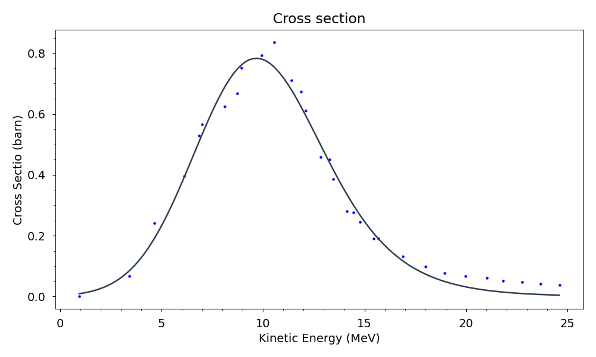
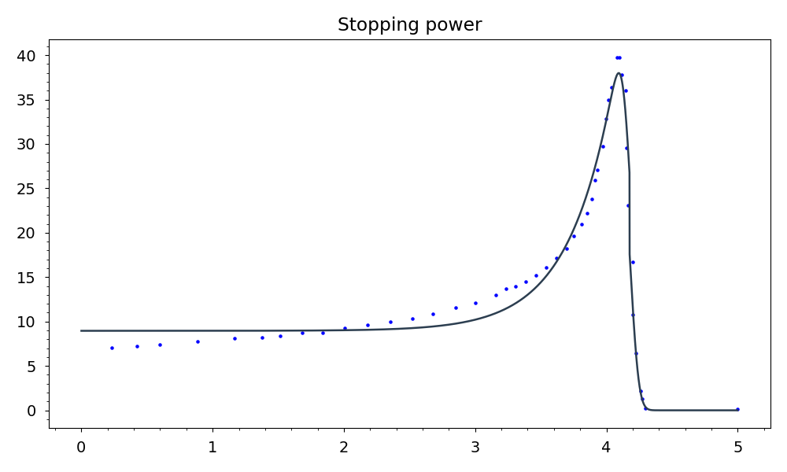

# Rate_calculation_program

This repository contains a Python program designed to calculate the total reaction rate of a nuclear reaction (e.g. 64Ni(p,n)64Cu ). The program calculates the reaction rate by integrating over the thickness of the target material, taking into account the varying kinetic energy of the projectiles and the beam current intensity.

The main steps of the used algorithm are:
1.  Prepare data: Load and preprocess the experimental data for cross-sections and stopping power from the provided files.
2.  Fit models: Apply curve-fitting techniques to the data to derive models for both the cross-section and stopping power.
3.  Generate Plots: Create visualizations of the fitted models and the resulting reaction rates to aid in analysis and interpretation.
4.  Calculate Energy Loss: For each slice of the target, compute the projectile's energy loss based on the stopping power model.
5.  Numerical integration: Sum the reaction rates across all slices to get the total reaction rate.

# Libraries
To use this program, you need to install some Python libraries (you find them in [Requirements.txt](https://github.com/Lorenzo9801/Rate_calculation_program/blob/main/Requirements.txt)):numpy, scipy, matplotlib, lmfit, pytest, npat.
You can install them by using the following command on your terminal: pip install -r requirements.txt

# How to use the repository

In order to use this program you need to:
- install the libraries you find in [Requirements.txt](https://github.com/Lorenzo9801/Rate_calculation_program/blob/main/Requirements.txt);
- Have a dataset of cross section of a nuclear reaction. This dataset should be structured as a txt file with two columns: the first column should list the projectile energy values (in MeV), and the second column should contain the corresponding cross-section values. You can source this data from experimental databases such as EXFOR. You can find an example of dataset in [cross section 64ni(p,n)64Cu.txt](https://github.com/Lorenzo9801/Rate_calculation_program/blob/main/data/cross%20section%2064Ni(p%2Cn)64Cu.txt) ;
- Have data of the stopping power of a projectil into the target. This dataset should be structured in a txt file with two columns: the first column should represent the depth of the projectile within the target (in mm), and the second column should indicate the energy loss per unit distance traveled. You can obtain this data using tools like the SRIM-2008 software. You can find an example of dataset in [stopping power 50 MeV.txt](https://github.com/Lorenzo9801/Rate_calculation_program/blob/main/data/stopping%20power%2050%20MeV.txt);
- set up the configuration, according to your nuclear reaction and according to your data files path [configuration.txt](https://github.com/Lorenzo9801/Rate_calculation_program/blob/main/configuration.txt);
- You can launch the file [Rate_calculation](https://github.com/Lorenzo9801/Rate_calculation_program/blob/main/Rate_calculation.py) which imports its parameters from configuration;
- In the file [testing](https://github.com/Lorenzo9801/Rate_calculation_program/blob/main/testing.py) I have tested all the functions in [funcions_defintion](https://github.com/Lorenzo9801/Rate_calculation_program/blob/main/functions_definition.py) except Plotting function.

# Theoretical references
The total rate of a nuclear rection can be obtained thanks to the following expression: 
%20%5Ccdot%20%5Cfrac%7BI_a%7D%7BZ%20e%7D%20%5Ccdot%20%5Cfrac%7B%5Csigma_X%7D%7BA.W.%7D%5Ccdot%20N_A)

- where σ(Ka) is the cross section of the reaction if the beam has an incident energy Ka;
- Ia is the current of the beam of charged particles passing through the target;
- Z is the atomic number of the particles constituting the beam;
- e is the electric charge of the particles constituting the beam;
- σX is the surface density of the target;
- W.A. is the atomic weight;
- NA is Avogadro's number.

The cross-section as a function of energy can be derived using experimental databases such as EXFOR. It will be necessary to fit the experimental data using an appropriate curve.

To calculate the total rate through the entire thickness of the target, each quantity appearing in the previous formula must be expressed as a function of the distance traveled by the projectiles through the target.

We need to write the kinetic energy of the protons as a function of the distance traveled inside the target, considering their energy loss while passing through the target.

The curve that describes the energy loss of a projectile through matter as a function of the distance it has traveled is the Bragg curve. It is possible to use experimental data to obtain the Bragg curve.

The energy of the projectile, having an initial value K0 at a certain depth within the target will be given by the expression:
=K_0-\frac{dE}{dx}\cdot%20x)
where  is the stopping power.

Also, the beam current intensity depends on the position. In fact, the velocity of the projectile particles decreases inside the target. Consequently, the current will also decrease following the expression: )=I_0\cdot%20\sqrt{\frac{K(x)}{K_0}})

At this point, it is possible to determine the kinetic energy of a beam with initial current I as a function of depth within the target.

Afterwards, a numerical integral over the thickness of the target will be performed to obtain the total rate.

# To show you some results:

1) this is the fitting o the cross section data of the reaction 64Ni(p,n)64Cu with an initial kinetic energy of the projectil of 50 MeV and  a current beam of 1mA

2) this is the fitting of the stopping power of protons with initial kinetic energy trought a nickel target

Projectile energy is exhausted at slice 835.
projectil stops at 4.175mm.
The value of the estimated rate is:  6.873210333828756e+16  s^-1

