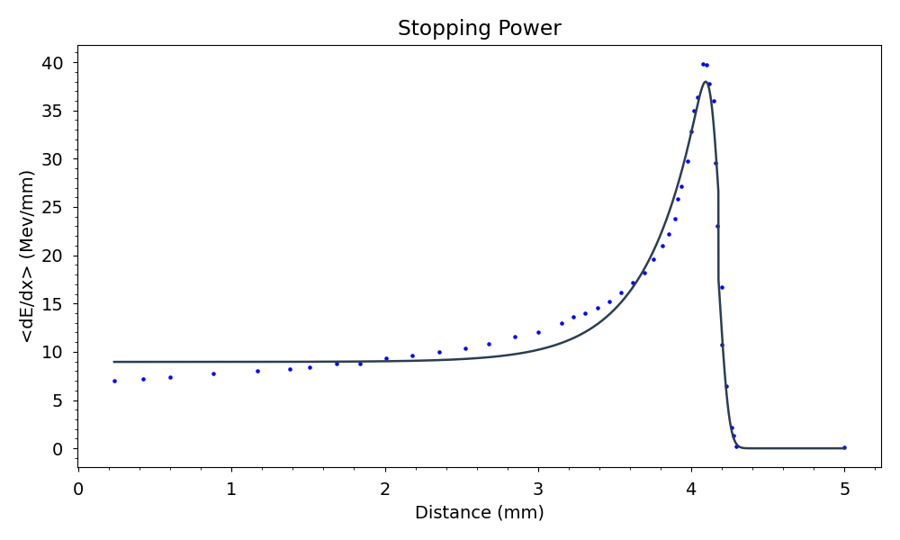

# Rate_calculation_program

The aim of this program is to calculate the total rate of a nuclear reaction (e.g. 64Ni(p,n)64Cu ).
The total rate of a nuclear rection can be obtained thanks to the following expression: 
%20%5Ccdot%20%5Cfrac%7BI_a%7D%7BZ%20e%7D%20%5Ccdot%20%5Cfrac%7B%5Csigma_X%7D%7BA.W.%7D%5Ccdot%20N_A)

- where σ(Ka) is the cross section of the reaction if the beam has an incident energy Ka;
- Ia is the current of the beam of charged particles passing through the target;
- Z is the atomic number of the particles constituting the beam;
- e is the electric charge of the particles constituting the beam;
- σX is the surface density of the target;
- W.A. is the atomic weight;
- NA is Avogadro's number.

The cross-section as a function of energy can be derived using experimental databases such as EXFOR. It will be necessary to fit the experimental data using an appropriate curve.

To calculate the total rate through the entire thickness of the target, each quantity appearing in the previous formula must be expressed as a function of the distance traveled by the projectiles through the target.

We need to write the kinetic energy of the protons as a function of the distance traveled inside the target, considering their energy loss while passing through the target.

The curve that describes the energy loss of a projectile through matter as a function of the distance it has traveled is the Bragg curve. It is possible to use experimental data to obtain the Bragg curve.

The energy of the projectile, having an initial value K0 at a certain depth within the target will be given by the expression:
=K_0-\frac{dE}{dx}\cdot%20x)
where  is the stopping power.

Also, the beam current intensity depends on the position. In fact, the velocity of the projectile particles decreases inside the target. Consequently, the current will also decrease following the expression: )=I_0\cdot%20\sqrt{\frac{K(x)}{K_0}})

At this point, it is possible to determine the kinetic energy of a beam with initial current I as a function of depth within the target.

Afterwards, a numerical integral over the thickness of the target will be performed to obtain the total rate.

# Structure of the program

In order to use this program you need to:
- install the library npat;
- have data of cross section of a nuclear reaction (you can search on EXFOR);
- have data of the stopping power of a projectil into the target (you can use SRIM-2008 software);
- set up the configuration, according to your nuclear reaction and according to your data [configuration](https://github.com/Lorenzo9801/Rate_calculation_program/blob/main/configuration.txt).

This is how I divided my project into blocks:

- In [funcions_defintion](https://github.com/Lorenzo9801/Rate_calculation_program/blob/main/functions_definition.py) you can find the definition of all the function you need to calculate the total rate of nuclear reaction. Inside, you will find the definition of a function that fits both the data of the cross-section and the stopping power. You will also find a function that plots the graphs. Finally, there is a function that performs the numerical integration.

- In the [configuration](https://github.com/Lorenzo9801/Rate_calculation_program/blob/main/configuration.txt) you can find the settings for the values of the nuclear reaction cross-sections, the values of some physical constants and the names of the data files.

- In [data]((https://github.com/Lorenzo9801/Rate_calculation_program/blob/main/data)) You can find the data for the cross-section of the nuclear reaction 64Ni(p,n)64Cu and the stopping power data for three different initial kinetic energies of the protons in a nickel target. 

- In [Rate_calculation](https://github.com/Lorenzo9801/Rate_calculation_program/blob/main/Rate_calculation.py) I use the function defined in [funcions_defintion](https://github.com/Lorenzo9801/Rate_calculation_program/blob/main/functions_definition.py) and using the data in [dat](https://github.com/Lorenzo9801/Rate_calculation_program/tree/main/data) to calculate the total cross section of the reaction 64Ni(p,n)64Cu where the protons have an initial kinetic energy of 50 MeV.

- In [testing](https://github.com/Lorenzo9801/Rate_calculation_program/blob/main/testing.py) I test cross_section and stopping_power functions to ensure that all of them work properly, using hypothesis testing. I also test a part of the Fitting function, to be sure to have the right output both for the fitting of the cross section data and for the stopping power data.

To show you some results:
1) this is the fitting o the cross section data of the reaction 64Ni(p,n)64Cu 

2) this is the fitting of the stopping power of protons with initial kinetic energy trought a nickel target

The value of the estimated rate is:  986308679.834243  s^-1
